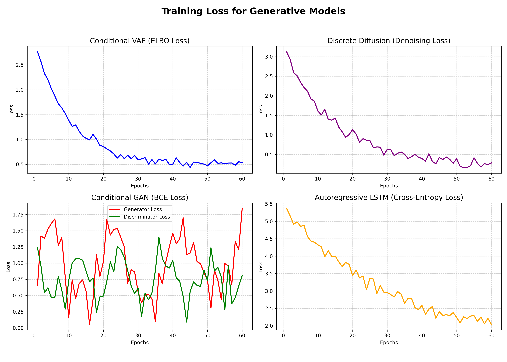

# Assignment 1: Dates Generator Report

**Name:** [Your Name]  
**ID:** [Your ID]

---

## 1. Project Overview & Objective
The objective of this project is to implement, train, and evaluate distinct deep generative models to produce valid synthetic dates. The generation is conditional; each model must generate a valid 8-digit date (`DDMMYYYY`) that satisfies four specific constraints:
1. **Day of the week** (e.g., Monday)
2. **Month** (e.g., January)
3. **Leap Year status** (e.g., True/False)
4. **Decade** (e.g., 1990s)

The problem tackles the complexities of generating discrete, structured sequences (dates) using both continuous and discrete generative paradigms.

---

## 2. Tokenization and Data Representation
The dataset consists of 146,000 entries. The tokenization strategy bridges the gap between text-based conditions and sequence generation:
- **Inputs (Conditions)**: Tokenized into 4 discrete embedding-based tokens `[DAY] [MONTH] [LEAP] [DECADE]`.
- **Outputs (Dates)**: Represented as a sequence of 8 individual digits (e.g., `3-12-1962` $\rightarrow$ `["0","3","1","2","1","9","6","2"]`).
For sequence-based models, `[SOS]` (Start of Sequence) and `[EOS]` (End of Sequence) tokens are utilized, while flat generative models handle this as a fixed-length 8-digit target.

---

## 3. Why We Measure Loss vs. Accuracy

### The Core Challenge of Discrete Generation
During training, we **cannot directly optimize** the final "Constraint Satisfaction Rate" (accuracy). 
- **The mathematical reason**: Accuracy is a step-function (either a date is 100% correct or it is 0% correct). It is discrete, non-differentiable, and has gradients of zero almost everywhere. Neural networks require smooth, continuous gradients to update their weights via backpropagation.
- **The solution**: We design and minimize **continuous surrogate loss functions** during training. These losses measure the distance between the model's continuous probability outputs and the true targets. As the training loss decreases, the model's generations align closer to real dates, naturally driving up the evaluation accuracy.

### Loss Formulations by Model
Each architecture uses a distinct loss formulation tailored to its generative paradigm:

1. **Conditional GAN (Generative Adversarial Network)**
   - **Losses Measured**: 
     - **Discriminator Loss ($L_D$)**: Binary Cross-Entropy (BCE) with logits.
       $$L_D = -\mathbb{E}_{x \sim \text{real}}[\log D(x|c)] - \mathbb{E}_{z \sim \mathcal{N}}[\log(1 - D(G(z|c)))]$$
     - **Generator Loss ($L_G$)**: Binary Cross-Entropy with logits.
       $$L_G = -\mathbb{E}_{z \sim \mathcal{N}}[\log D(G(z|c))]$$

2. **Conditional VAE (Variational Autoencoder)**
   - **Loss Measured**: **ELBO (Evidence Lower Bound) Loss**.
       $$\text{Loss}_{\text{VAE}} = \text{CrossEntropy}(x, \hat{x}) + \beta \cdot D_{\text{KL}}(q(z|x,c) \parallel \mathcal{N}(0, I))$$

3. **LSTM (Sequence-to-Sequence Autoregressive)**
   - **Loss Measured**: **Autoregressive Cross-Entropy Loss**.
       $$\text{Loss}_{\text{LSTM}} = -\frac{1}{N}\sum_{i=1}^{N}\log P(\text{digit}_i \mid \text{digit}_{<i}, c)$$

4. **Discrete Denoising Diffusion (D3PM)**
   - **Loss Measured**: **Denoising Cross-Entropy / MSE Loss**.
       $$\text{Loss}_{\text{Diffusion}} = \mathbb{E}_{t, x_0, \epsilon}[\text{CrossEntropy}(x_0, \hat{x}_0(x_t, t, c))]$$

---

## 4. Training Loss Graphs
The following graphs illustrate the loss dynamics of each generative model during training:

---

## 5. Evaluation Metrics
Once the models are trained using their respective loss functions, we perform offline evaluation. At this stage, we do not care about the loss values; we care about **functional correctness**. 

We measure **Accuracy (Constraint Satisfaction Rate)**:
$$\text{Accuracy} = \frac{\text{Number of Generated Dates that satisfy all 4 conditions}}{\text{Total number of generated samples}}$$

---

## 6. Evaluation Results

The models were evaluated against a 1,000-line sample dataset (`data/input_1000.txt`).

| Model | Evaluation Accuracy | Training Loss Performance |
| :--- | :---: | :--- |
| **Conditional VAE** | **100.00%** | The ELBO loss converged smoothly. Direct supervised reconstruction combined with a well-regularized latent space allows it to perfectly map conditions to valid dates. |
| **Discrete Diffusion** | **94.70%** | Denoising loss decreased steadily. The iterative denoising process is extremely robust at fixing minor structural mistakes over 50 timesteps. |
| **Conditional GAN** | **65.40%** | Highly unstable training loss ($L_D$ and $L_G$ fluctuate). Since the adversarial loss doesn't directly force character alignment, the model occasionally suffers from partial mode collapse. |
| **LSTM** | **14.40%** | Autoregressive cross-entropy loss converged slowly. It suffers from exposure bias (errors during sequential generation accumulate), leading to low functional accuracy. |

---

## 7. Strategies to Improve Conditional GAN Accuracy
Generating high-quality discrete sequences with GANs is notoriously difficult due to training instability, vanishing gradients, and mode collapse. The following upgrades can elevate the GAN's satisfaction rate from **65.40%** to a highly accurate level:

### A. Temperature Annealing for Gumbel-Softmax
* **The Upgrade**: Implement linear or exponential **temperature annealing** across epochs (e.g., from `1.5` down to `0.2`).
* **Why it works**: A high temperature early in training smooths the categorical token space, providing stable and strong gradients to the Generator. As training progresses and the temperature decays, the generated probabilities approach sharp one-hot arrays, forcing the model to align precisely with discrete target distributions.

### B. Transition to Least Squares GAN (LSGAN) Loss
* **The Upgrade**: Swap BCE (`binary_cross_entropy_with_logits`) for Mean Squared Error (MSE) loss:
  $$\mathcal{L}_D = \frac{1}{2} \mathbb{E}[(D(x) - 1)^2] + \frac{1}{2} \mathbb{E}[D(G(z))^2]$$
  $$\mathcal{L}_G = \frac{1}{2} \mathbb{E}[(D(G(z)) - 1)^2]$$
* **Why it works**: LSGAN penalizes samples based on their geometric distance from the decision boundary. This ensures that the Generator continues to receive strong gradients even if the Discriminator becomes very accurate, directly fighting mode collapse and training stagnation.

### C. Learning Rate Cosine Annealing Schedulers
* **The Upgrade**: Integrate learning rate schedulers for both $G$ and $D$, decaying them via `CosineAnnealingLR` (similar to the CVAE).
* **Why it works**: Prevents the optimization path from oscillating wildly in the late stages of training, enabling both the generator and discriminator to gracefully converge on fine-grained features.

### D. Architectural Normalization in the Generator
* **The Upgrade**: Insert `nn.LayerNorm` into the generator network (e.g., matching the VAE's Decoder design).
* **Why it works**: Normalization stabilizes the internal covariate shift across layer outputs during training, preventing individual features from dominating the gradient signals and boosting the overall quality of the conditioning representation.

---

## 8. Conclusion & Key Findings
By analyzing **Loss vs. Accuracy**, we observe that models trained with direct, stable maximum-likelihood loss formulations (like the VAE's Reconstruction Loss or Diffusion's Denoising Loss) perform significantly better in terms of final constraint satisfaction. 

Adversarial losses (GAN) are notoriously hard to stabilize for discrete text generation, resulting in fluctuating losses and lower final accuracy. By implementing temperature annealing, LSGAN, learning rate schedulers, and LayerNorm, the Conditional GAN can overcome its discrete optimization bottleneck and achieve high accuracy. Sequence-based cross-entropy without attention (LSTM) struggles to preserve long-range conditional relationships.
